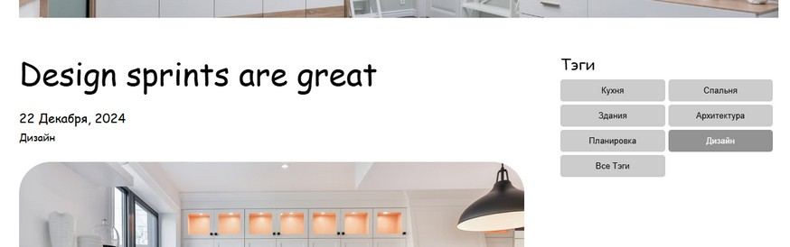
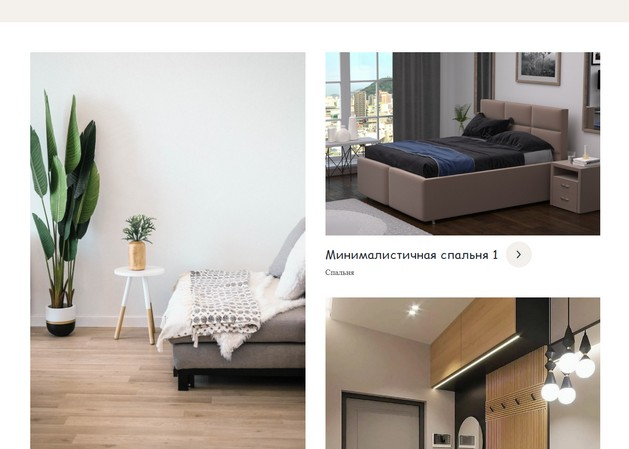
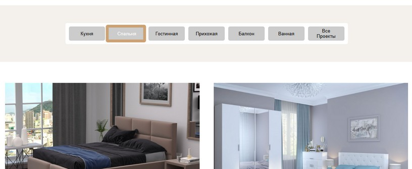

# Фреймворк Vue.js. Обучение в записи

# Урок 12. Семинар: Взаимодействие между компонентами
## Работа с макетом

1. Перевести весь проект на компоненты, теперь можно работать с пропсами<br> 
и выводить компоненты удобным для вас способом, <br>
чтобы их в дальнейшем можно было сортировать или менять.<br>

2. Создать страницу Project (Домашнее задание 6).<br>

3. В блоке categoreis необходимо сделать переключение проектов на ваше усмотрение.<br><br>

Проект один в один создавать не нужно, работаем исключительно с кодом, <br> 
любая стилистика уходит на второй план.<br> 
Если нет времени на добавление стилей, <br> 
создавайте логику сайта, а вёрстку можно будет доделать и позже.
<br><br>

#### Задание по работе с макетом направлено на подготовку проекта к итоговой аттестации.

<br>
<br>

#### Формат сдачи: ссылка на гитхаб.

<br><br>

### Решение задания

<br><br>

Перейти в папку с проектом и выполнить запуск:
```
npm run serve

```


#### Задача 1

Чтобы выделить элементы верстки или компонента страницы в отдельный компонент, <br>
создаем в папке components/ файл нового компонента, например, BlogDetailsSection.vue. <br>
Сохраняем структуру компонента аналогично другим файлам компонента: <br>
```<template>``` для разметки html, которую переносим из исходного файла, в данном случае из BlogDetails.vue. <br>
```<script>``` для передачи логики компонента <br>
```<style>``` для подключения файлов стилей <br><br>
В разметке <template> файла BlogDetails.vue устанавливаем тэг нового компонента 
```<BlogDetailsSection :posts="posts" :tags="tags" />```,
где используются ```:posts``` и ```:tags``` для передачи данных в компонент BlogDetailsSection через ```props```.
Также в файле BlogDetails.vue импортируем компонент BlogDetailsSection как и другие необходимые компоненты header, footer:
```
<script>
import Header from '@/components/Header.vue';
import Footer from '@/components/Footer.vue';
import BlogDetailsSection from '@/components/BlogDetailsSection.vue';

```
Для рендеринга списка постов и тегов используется ```v-for```. <br>
На странице blog-details в проекте Vue-CLI выводится исходный код верстки и разметка html.




<br><br>
**Аналогично можно выделить из основного файла и разместить <br> в отдельных компонентах другие элементы исходного кода страниц проекта.**

#### Задача 2

Страница Project разработана в качестве компонента проекта Vue-CLI как Projects.vue



#### Задача 3

Переключение проектов на странице возможно с помощью выбора тэга в "меню проектов" 



<br><br><br><br>